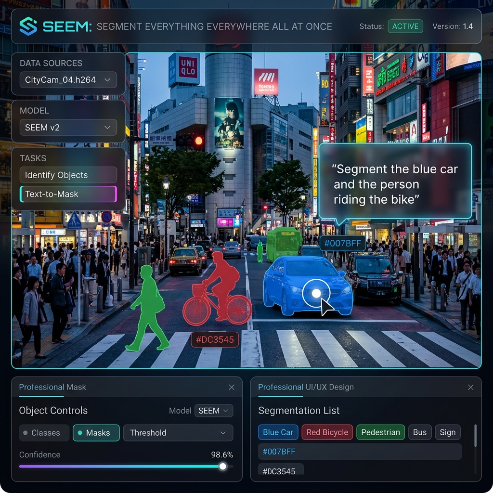

# 👀 SEEM: Segment Everything Everywhere All at Once 🍇


Segment anything in an image using multi-modal prompts (text, audio, points, scribbles, and bounding boxes) simultaneously. Built for AI researchers and developers who need a universal, zero-shot segmentation engine that understands complex, overlapping human intentions.



## ✨ Key Features

- **Segment with multi-modal prompts**: Combine visual inputs (points, boxes) with semantic inputs (text, audio) to resolve complex ambiguities.
- **Process audio prompts natively**: Speak to the model (e.g., "Segment the red car") to generate highly accurate spatial masks.
- **Achieve state-of-the-art interactive segmentation**: Outperform traditional models (including SAM) in interactive scenarios despite training on 50x less data.
- **Support referring video segmentation**: Track and segment entities across video frames based on text descriptions.
- **Integrate easily with LLMs**: Acts as the powerful visual grounding backbone for visual-language models like LLaVA and GPT-4V.
- **Deploy flexibly with multiple checkpoints**: Choose between SEEM-Tiny for edge deployment or SEEM-Large for maximum accuracy.

## 🚀 Quick Start

Run your first multi-modal segmentation in under 5 minutes on Linux.

1. **Clone and Run the Demo Script**:
   ```bash
   git clone git@github.com:UX-Decoder/Segment-Everything-Everywhere-All-At-Once.git
   cd Segment-Everything-Everywhere-All-At-Once
   sh assets/scripts/run_demo.sh
   ```

**Expected Output:**
The script will install dependencies, download the SEEM-Tiny checkpoint, and launch a local Gradio web UI. You can upload an image, type a text prompt, and instantly see the generated segmentation mask overlaying your image.

*You have just run a state-of-the-art universal segmentation model with zero configuration!*

## 📦 Installation

Choose the setup that best matches your hardware and environment.

### Method 1: Local PyTorch Setup
```bash
conda create -n seem python=3.9 -y
conda activate seem
pip install torch torchvision torchaudio --index-url https://download.pytorch.org/whl/cu118
pip install -r requirements.txt
cd modeling/pixel_decoder/ops
python setup.py build develop
```

### Method 2: Virtual Environment
For a reproducible, isolated environment using venv:
```bash
python -m venv venv
source venv/bin/activate
pip install torch torchvision torchaudio --index-url https://download.pytorch.org/whl/cu118
pip install -r requirements.txt
cd modeling/pixel_decoder/ops
python setup.py build develop
```

## 💡 Usage Examples

### Example 1: Text-Based Segmentation (Python API)
**Scenario:** You want to segment an object using just a string description.
```python
from seem.inference import build_seem_model
model = build_seem_model("configs/seem_focall_lang.yaml", "seem_focall_v1.pt")
image = load_image("car.jpg")
outputs = model.predict(image, text_prompt="the left front tire")
```
**Output:** Returns a binary mask tensor corresponding exactly to the left front tire.

### Example 2: Audio-Prompted Segmentation
**Scenario:** Segmenting an image based on an uploaded audio file.
```python
# Assuming 'audio.wav' contains the spoken phrase "a flying bird"
outputs = model.predict(image, audio_prompt="audio.wav")
visualize_mask(image, outputs['mask'])
```
**Output:** The model encodes the audio into a semantic space and grounds it to the image, generating a mask around the bird.

### Example 3: Combining Point and Text Prompts
**Scenario:** The text "the chair" is ambiguous because there are 5 chairs. You combine it with a single point coordinate.
```python
prompts = {
    "text": "the chair",
    "point": [450, 320] # x, y coordinate
}
outputs = model.predict(image, prompts=prompts)
```
**Output:** The model uses the point to isolate the specific instance and the text to understand the semantic category, delivering a perfect mask.

### Example 4: Referring Video Segmentation
**Scenario:** Tracking a described object across a video clip.
```bash
python demo/video_demo.py --video input.mp4 --text "the man in the red shirt running" --output out.mp4
```
**Output:** `out.mp4` where the specified man is highlighted with a temporal tube/mask across all frames.

## 🛠️ Troubleshooting

- **`ModuleNotFoundError: No module named 'MultiScaleDeformableAttention'`**
  - *Cause:* The custom CUDA operators for the pixel decoder were not compiled.
  - *Fix:* Navigate to `modeling/pixel_decoder/ops` and run `python setup.py build develop`.
- **OOM (Out of Memory) during evaluation**
  - *Cause:* High resolution images combined with the SEEM-Large model on a GPU with < 16GB VRAM.
  - *Fix:* Switch to the `seem_focalt_v1.pt` (Tiny) checkpoint or reduce the `TEST.MIN_SIZE_TEST` parameter in the config file.
- **Audio prompt not working**
  - *Cause:* Missing system dependencies for audio processing.
  - *Fix:* Ensure `ffmpeg` is installed on your OS (`sudo apt install ffmpeg`).

## 📚 Documentation Links

Unleash the true power of SEEM's multi-modal capabilities by diving into our comprehensive documentation:

- **[System Architecture](./docs/ARCHITECTURE.md)**
  Explore the cutting-edge design behind our universal segmentation engine. Discover how visual inputs and semantic prompts are projected into a joint semantic space, detailing the data flow that resolves complex human intentions.

- **[API Reference](./docs/API_REFERENCE.md)**
  Master the Python interfaces to seamlessly integrate SEEM into your visual-language pipelines. This guide details the specific API payloads for multi-modal prompting, from passing bounding box coordinates to routing audio files for zero-shot spatial mask generation.

- **[Configuration Guide](./docs/CONFIGURATION.md)**
  Optimize the segmentation engine for your specific deployment needs, whether running on edge devices or powerful cloud GPUs. Learn how to select the right checkpoints and perform exhaustive hyperparameter tuning to prevent out-of-memory errors during high-resolution inference.

## 🤝 Contributing

We welcome community contributions! Please check out our open issues, submit PRs, and ensure you run the testing suite (`pytest tests/`) before submitting.

## 📄 License

This project is released under the MIT License. See [LICENSE](./LICENSE) for more details.

## 👏 Credits
Authored by the incredible team at UX-Decoder, University of Wisconsin-Madison, and Microsoft Research. Special thanks to the Segment Anything and X-Decoder projects.
